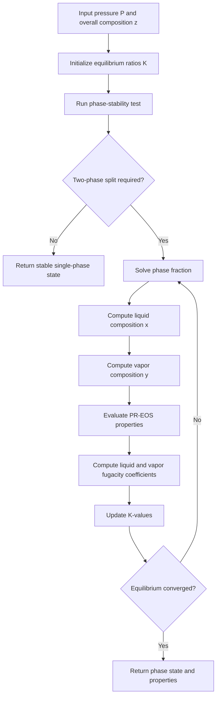
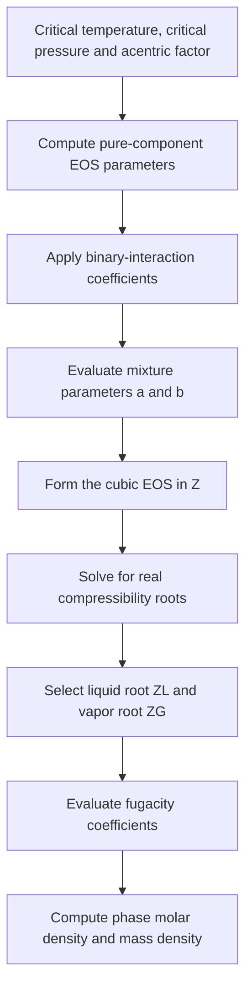
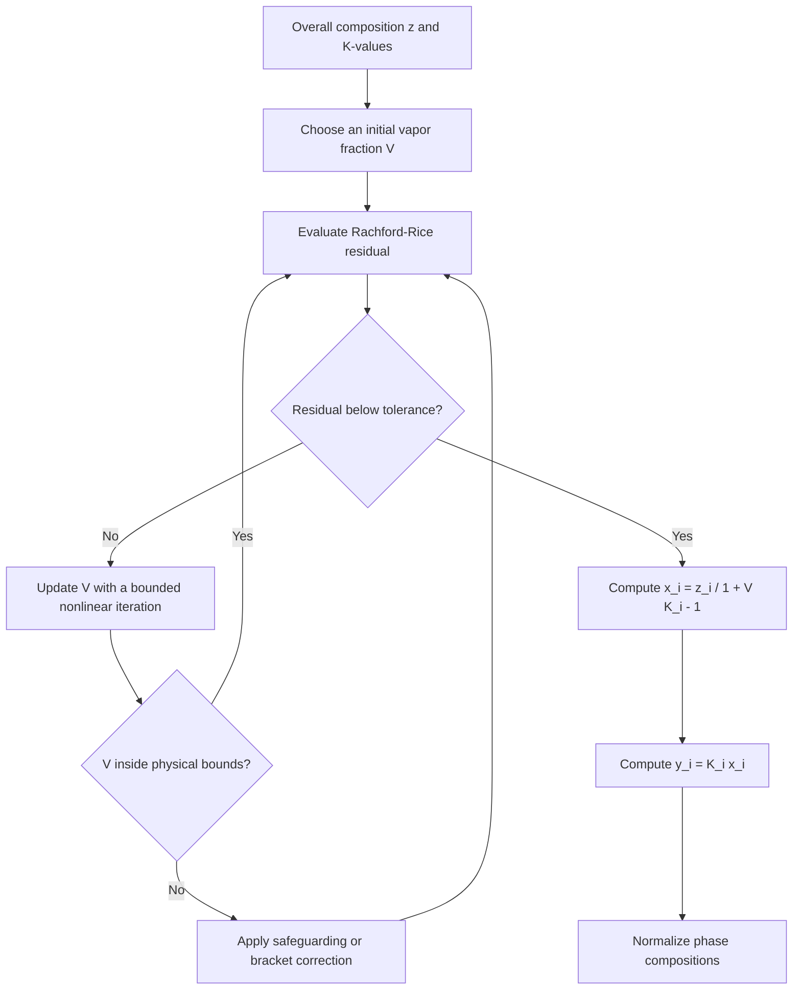
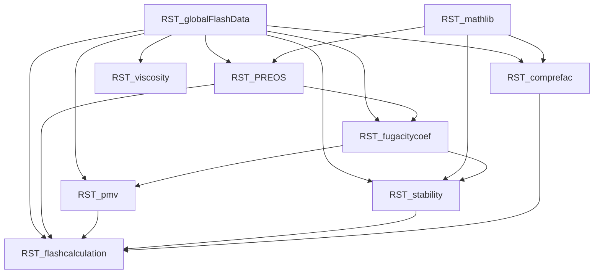

# FlashCalculation

A modular Fortran library for multicomponent phase-stability analysis and isothermal two-phase flash calculations using the Peng–Robinson equation of state.


## Overview

**FlashCalculation** provides thermodynamic routines that can be embedded in compositional-flow and reservoir-simulation software. The library evaluates phase stability, performs liquid–vapor flash calculations, computes Peng–Robinson EOS properties, and returns phase compositions and related fluid properties.

The repository contains the core iterative flash solver as well as optional full-grid, sparse-grid, and neural-network-oriented variants.

### Capabilities

- Multicomponent isothermal two-phase flash calculation
- Phase-stability testing
- Peng–Robinson equation of state
- Liquid and vapor fugacity coefficients
- Rachford–Rice phase-fraction solution
- Compressibility-factor and cubic-root calculations
- Liquid and gas density evaluation
- Mixture viscosity calculation
- Full-grid lookup implementations for two- and three-component systems
- Interfaces for sparse-grid and neural-network-assisted variants

> [!IMPORTANT]
> This repository currently contains reusable Fortran modules rather than a standalone executable. A host program must initialize the global fluid data and call the desired flash-calculation routine.

## Thermodynamic Framework


## Flash Calculation Workflow



At equilibrium, each component satisfies the fugacity condition:

```text
f_i^L = f_i^V
```

where `f_i^L` and `f_i^V` are the liquid- and vapor-phase fugacities of component `i`.

## Peng–Robinson EOS Workflow



The Peng–Robinson equation is represented in the library through mixture parameters and a cubic equation for the compressibility factor `Z`.

## Rachford–Rice Iteration



The scalar Rachford–Rice equation is

```text
sum_i z_i (K_i - 1) / [1 + V (K_i - 1)] = 0
```

where `V` is the vapor fraction, `z_i` is the overall mole fraction, and `K_i = y_i / x_i` is the equilibrium ratio.

## Repository Structure

```text
FlashCalculation/
├── LICENSE
├── .gitignore
├── RST_globalFlashData.F90
├── RST_mathlib.F90
├── RST_PREOS.F90
├── RST_fugacitycoef.F90
├── RST_stability.F90
├── RST_pmv.F90
├── RST_comprefac.F90
├── RST_viscosity.F90
├── RST_flashcalculation.F90
├── RST_flashcalculation_fullgrid_2c.F90
├── RST_flashcalculation_fullgrid_3c.F90
├── RST_flashcalculation_sparsegrid.F90
└── RST_flashcalculation_nn.F90
```

## Module Reference

| Module | Purpose |
|---|---|
| `RST_globalFlashData` | Stores global fluid properties, component count, temperature, binary-interaction coefficients, and optional lookup-table data. |
| `RST_mathlib` | Provides Gaussian elimination, cubic-root calculation, sorting, and prime-number utilities. |
| `RST_PREOS` | Evaluates Peng–Robinson EOS mixture properties for liquid and gas phases. |
| `RST_fugacitycoef` | Computes liquid- and vapor-phase fugacity coefficients. |
| `RST_stability` | Performs thermodynamic phase-stability analysis. |
| `RST_pmv` | Computes phase fraction and contains iterative flash substeps. |
| `RST_comprefac` | Computes a fluid compressibility-related quantity from EOS results. |
| `RST_viscosity` | Evaluates phase viscosity from composition and phase properties. |
| `RST_flashcalculation` | Main iterative flash-calculation interface. |
| `RST_flashcalculation_fullgrid_2c` | Full-grid lookup implementation for two-component systems. |
| `RST_flashcalculation_fullgrid_3c` | Full-grid lookup implementation for three-component systems. |
| `RST_flashcalculation_sparsegrid` | Sparse-grid-assisted flash-calculation interface. |
| `RST_flashcalculation_nn` | Neural-network-assisted flash-calculation interface. |

## Core Dependency Graph



## Public Interfaces

### Main flash calculation

```fortran
use RST_flashcalculation, only: flashcalculation
```

The primary routine is declared as:

```fortran
subroutine flashcalculation(P, local_z, x, y, xiL, xiG, rhoL, &
                            rhoG, sL, local_v, local_Cf, isW, isN)
```

The exact array dimensions and physical conventions are defined by the host application and the global data module. In general, the routine receives pressure and overall composition and returns liquid/vapor compositions, phase densities, liquid fraction, vapor fraction, compressibility information, and phase-state flags.

### Peng–Robinson EOS

```fortran
use RST_PREOS, only: PREOS
```

```fortran
subroutine PREOS(x, y, P, ZL, ZG, am, bm, al, ag, bl, bg, &
                 bigAL, bigAG, bigBL, bigBG, xiL, xiG, rhoL, &
                 rhoG, CfL, CfG)
```

### Phase stability

```fortran
use RST_stability, only: stability
```

```fortran
subroutine stability(Pk, ZI, ztest, Kstabtry, size_try, K_stab, judge)
```

### Viscosity

```fortran
use RST_viscosity, only: viscosity
```

```fortran
mu = viscosity(x, xi, P, phase)
```

## Required Fluid Data

Before calling the thermodynamic routines, the host application must initialize the variables exposed by `RST_globalFlashData`.

| Variable | Meaning |
|---|---|
| `Nc` | Number of components |
| `Temp` | System temperature |
| `ct(:)` | Critical temperatures |
| `cp(:)` | Critical pressures |
| `af(:)` | Acentric factors |
| `mw(:)` | Molecular weights |
| `cv(:)` | Critical volumes or related component-volume data used by the viscosity model |
| `psatA(:)`, `psatB(:)`, `psatC(:)` | Component vapor-pressure correlation coefficients |
| `delta(:,:)` | Binary-interaction coefficients |

The host program is responsible for allocating these pointer arrays and assigning physically consistent units.

## Building the Core Library

A Fortran compiler with preprocessing support is required because several source files contain `#ifdef` directives.

### GNU Fortran

Compile the core modules in dependency order:

```bash
gfortran -cpp -O3 -c \
  RST_globalFlashData.F90 \
  RST_mathlib.F90 \
  RST_PREOS.F90 \
  RST_fugacitycoef.F90 \
  RST_stability.F90 \
  RST_pmv.F90 \
  RST_comprefac.F90 \
  RST_viscosity.F90 \
  RST_flashcalculation.F90
```

Create a static library:

```bash
ar rcs libflashcalculation.a *.o
```

Link the library with a host program:

```bash
gfortran -cpp -O3 example_driver.F90 -L. -lflashcalculation -o flash_example
```

> [!NOTE]
> The repository does not currently include `example_driver.F90`; the command above illustrates the intended library-integration workflow.

## Optional Implementations

### Full-grid lookup

The full-grid modules use conditional compilation:

```bash
gfortran -cpp -DFULL_2c -O3 -c \
  RST_globalFlashData.F90 \
  RST_flashcalculation_fullgrid_2c.F90
```

or

```bash
gfortran -cpp -DFULL_3c -O3 -c \
  RST_globalFlashData.F90 \
  RST_flashcalculation_fullgrid_3c.F90
```

The current `RST_globalFlashData.F90` contains machine-specific absolute paths for the full-grid data directories. Update `FULLGRIDPREFIX` before using these implementations.

### Sparse-grid implementation

`RST_flashcalculation_sparsegrid.F90` depends on an external or companion module named `RST_hashTable`, which is not included in this repository.

### Neural-network implementation

`RST_flashcalculation_nn.F90` depends on an external or companion module named `RST_getEquResidual`, which is not included in this repository.

These optional variants cannot be built from this repository alone until their missing dependencies and trained data or lookup data are supplied.

## Integration Checklist

1. Allocate the component-property arrays in `RST_globalFlashData`.
2. Set `Nc` and `Temp`.
3. Populate critical properties, acentric factors, molecular weights, and binary-interaction coefficients.
4. Supply pressure and a normalized overall composition.
5. Call `flashcalculation` or another selected implementation.
6. Check the phase-state flags and returned phase fractions.
7. Validate the returned compositions, densities, and fugacity equilibrium.

## Numerical Considerations

- Overall and phase compositions should be normalized and non-negative.
- Pressure, temperature, and component-property units must be consistent with the constants and correlations used in the source code.
- Near critical points, phase identification and convergence can become sensitive to initial equilibrium ratios and tolerances.
- Full-grid interpolation trades generality for speed and is limited to the tabulated component count and parameter domain.
- Sparse-grid and neural-network variants should be validated against the direct iterative solver before production use.

## Applications

The library can support research and software development in:

- Compositional reservoir simulation
- Geological carbon dioxide storage
- Underground hydrogen storage
- Enhanced oil recovery
- Hydrocarbon phase-behavior studies
- Multiphase porous-media flow
- Surrogate thermodynamic modeling

## Known Limitations

- No standalone driver, example input set, Makefile, or automated test suite is currently included.
- Global pointer-based state requires explicit initialization by the host application.
- The full-grid data path is currently hard-coded to the original developer's filesystem.
- Sparse-grid and neural-network variants have dependencies that are absent from this repository.
- The code is research software and should be independently validated for a target fluid system before engineering use.

## Suggested Project Roadmap

- [ ] Add a minimal executable example
- [ ] Add representative binary and ternary fluid datasets
- [ ] Add CMake or a portable Makefile
- [ ] Add unit tests for cubic roots, fugacity coefficients, stability, and flash convergence
- [ ] Remove machine-specific paths
- [ ] Document units and all routine arguments
- [ ] Add continuous integration with GNU Fortran
- [ ] Add benchmark comparisons against published phase-equilibrium data
- [ ] Package optional surrogate models and their dependencies

## Citation

When using this code in academic work, cite the repository and the associated publication, if applicable.

```bibtex
@software{wu_flashcalculation_2026,
  author  = {Yuanqing Wu},
  title   = {FlashCalculation: Fortran routines for phase stability and isothermal flash calculations},
  year    = {2026},
  license = {MIT}
}
```

## License

This project is distributed under the [MIT License](LICENSE).

## Author and Support

**Yuanqing Wu**  
King Abdullah University of Science and Technology (KAUST), Saudi Arabia

Support contact recorded in the source files: `wuyuanq@gmail.com`

Bug reports, reproducible test cases, and proposed improvements are welcome through GitHub Issues and Pull Requests.
